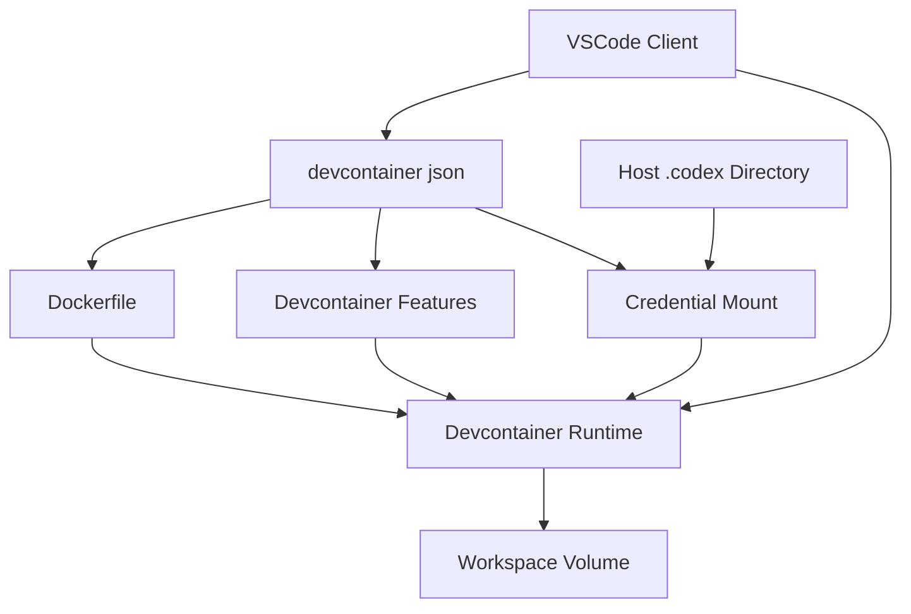
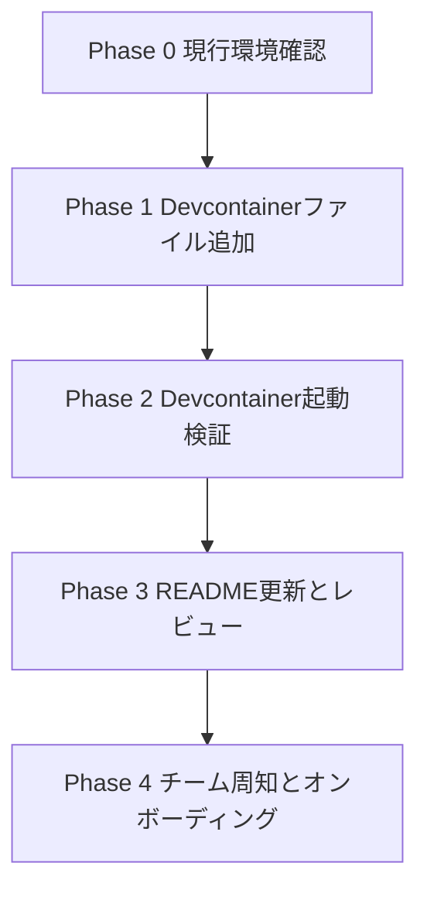

# Design Document

## Overview

この機能は、todoixプロジェクトにおける開発者向けDevcontainer環境を標準化し、Node.js 24系とpnpmワークスペースを即時利用できる状態を整備する。統一されたコンテナと推奨エディタ設定を提供することで、環境差異による不具合とセットアップ時間を削減する。

利用者はプロジェクトコントリビューターおよび新規参加開発者であり、VS Code Dev Containersを介して即時に開発を開始できることが目的である。既存のリポジトリにはDevcontainer構成が存在しないため、本仕様で新規に導入する。

### Goals

- Node.js 24およびpnpmワークスペースが起動直後から利用可能な開発環境を提供する
- keytar依存パッケージを含むDockerレイヤーを整備し、セキュアストレージ機能を動作させる
- READMEにDevcontainer利用手順を明記し、オンボーディング時間を短縮する
- Codex CLIがホストの`.codex`ディレクトリを再利用できる開発体験を提供する

### Non-Goals

- Windows向けサポートや別ツールチェーンの追加
- Devcontainer外でのローカル環境構築手順の整備
- CI/CD上でのコンテナビルド最適化やレジストリ公開

## Architecture

### Existing Architecture Analysis

- リポジトリはpnpmワークスペース構成を前提とするが、Devcontainer関連ファイルは未配置。
- `.vscode/settings.json`のみが存在し、拡張機能推奨は未定義。
- `.kiro/steering/`が存在しないため、プロジェクト標準は`docs/requirement.md`記載の情報を基準とする。

### High-Level Architecture

Devcontainer設定とDockerfileを中心に、VS Codeクライアントがdevcontainer機能を通じてコンテナを構築・起動する。ホスト側の`.codex`ディレクトリをバインドマウントし、コンテナ内のCLIから同一設定（認証情報・プロンプト等）を参照できるようにする。



### Technology Stack and Design Decisions

- **コンテナベース**: `mcr.microsoft.com/devcontainers/base:ubuntu`をベースに、Devcontainer FeaturesでNode.js 24とpnpmを提供。
- **パッケージマネージャ**: `ghcr.io/devcontainers-contrib/features/pnpm:2`でpnpmをインストールし、postCreateで`pnpm install`を自動実行。
- **鍵管理依存**: `libsecret-1-0`、`libsecret-1-dev`、`gnome-keyring`をAPTで導入し、keytarのビルドと実行を確実化。
- **認証情報マウント**: `mounts`オプションで`${localEnv:HOME}/.codex`を読み書き可能で`/home/vscode/.codex`へバインドし、必要に応じて`CODEX_CONFIG_DIR`などの環境変数で上書きすることでホストの`.codex`ディレクトリ全体を再利用。
- **ドキュメント**: `README.md`にDevcontainer拡張導入と起動手順、初回ビルド時の留意点を追記。

### Key Design Decisions

- **Decision**: Devcontainer FeaturesでNode.jsとpnpmを導入する  
  **Context**: Node.js 24とpnpmを素早く提供し、バージョン管理を簡素化する必要がある。  
  **Alternatives**: 1) Dockerfile内でNode.jsとpnpmを手動インストール、2) nvm経由でNode.jsを導入、3) ホストマシンに依存。  
  **Selected Approach**: Devcontainer Features (`ghcr.io/devcontainers/features/node:1`と`ghcr.io/devcontainers-contrib/features/pnpm:2`) を指定し、バージョン管理と更新を標準化。  
  **Rationale**: Devcontainer FeaturesはMicrosoftメンテナンスの標準手段であり、設定が簡潔で再利用性が高い。  
  **Trade-offs**: Feature取得に外部ネットワークが必要となるが、Devcontainer標準フローのため許容。

- **Decision**: Dockerfileでkeytar依存パッケージをAPTインストール  
  **Context**: keytarはlibsecretおよびgnome-keyringに依存し、これらがないとビルドが失敗する。  
  **Alternatives**: 1) Feature側に追加APTコマンドを記述、2) flatpak等別の秘密管理に切り替え、3) keytar依存を削除。  
  **Selected Approach**: DockerfileでAPT更新後に必要パッケージをインストールし、キャッシュ削減のため`rm -rf /var/lib/apt/lists/*`でクリーンアップ。  
  **Rationale**: Dockerfile管理によりインストール順序と依存バージョンを制御しやすい。  
  **Trade-offs**: イメージビルド時のネットワークアクセスが必要。APTリポジトリ更新失敗時のリトライを検討する必要がある。

- **Decision**: READMEにDevcontainer手順を記載  
  **Context**: 新規参加者がDevcontainer利用手順を理解できないと、環境準備にばらつきが生じる。  
  **Alternatives**: 1) wiki等別ドキュメントに記載、2) 口頭共有のみ、3) devcontainer.jsonの`customizations`で通知メッセージを表示。  
  **Selected Approach**: `README.md`に前提条件と起動手順を追記し、リポジトリ内で完結したドキュメントとする。  
  **Rationale**: READMEは最初に参照される公式ドキュメントであり、メンテナンス負荷が低い。  
  **Trade-offs**: READMEの内容が増えるため、セクション整理とリンク設計が必要。

- **Decision**: ホスト`.codex`ディレクトリをバインドマウントで共有する  
  **Context**: 開発者がコンテナへ移行する際にCodex CLIの認証情報やプロンプト設定を再配置せず、ホストと同一のワークフローを維持したい。  
  **Alternatives**: 1) Devcontainer起動時に`codex login`および設定同期を再実行、2) 認証トークンや設定ファイルを環境変数として個別に注入、3) `.codex`フォルダをコンテナ内に複製して管理。  
  **Selected Approach**: Host側のディレクトリ（`${localEnv:CODEX_CONFIG_DIR}`または`${localEnv:HOME}/.codex`）を`mounts`設定で`/home/vscode/.codex`に読み書き可能マウントし、CLIから透過的に利用する。  
  **Rationale**: バインドマウントは認証情報だけでなくカスタムプロンプト等も一括で共有でき、設定の二重管理を避けられる。  
  **Trade-offs**: ホスト側ディレクトリが存在しない場合はマウントが失敗するため、READMEで前提条件とフォールバック手順を案内する。

## System Flows

- 開発者がVS Code Dev Containersでリポジトリを開くと、`devcontainer.json`を参照してコンテナをビルド・起動する。
- コンテナ初回起動後、`postCreateCommand`により`pnpm install`が実行され、依存関係が整備される。
- コンテナ起動時に`mounts`設定がホストの`~/.codex`ディレクトリを`/home/vscode/.codex`へバインドし、Codex CLIが認証済み状態を引き継ぐ。
- 開発者はREADMEに従い、必要なVS Code拡張やコマンドで作業を開始する。

## Requirements Traceability

- **Req1** → `.devcontainer/devcontainer.json`の`features`、`customizations.vscode.extensions`で実現。
- **Req2** → `.devcontainer/Dockerfile`のAPTインストールセクションで実現。
- **Req3** → `devcontainer.json.postCreateCommand`で実現。
- **Req4** → `README.md`のDevcontainer手順セクションで実現。
- **Req5** → `devcontainer.json.mounts`によるホスト`.codex`ディレクトリの読み書き可能バインドとREADMEの前提条件記載で実現。

## Components and Interfaces

### Devcontainer Configuration (`.devcontainer/devcontainer.json`)

- **責務**: コンテナのビルド設定、Feature導入、VS Codeカスタマイズ、初回コマンド実行を定義。
- **主要フィールド**:

```json
{
  "name": "todoix",
  "build": {
    "dockerfile": "Dockerfile"
  },
  "features": {
    "ghcr.io/devcontainers/features/node:1": { "version": "24" },
    "ghcr.io/devcontainers-contrib/features/pnpm:2": {}
  },
  "postCreateCommand": "pnpm install",
  "customizations": {
    "vscode": {
      "extensions": [
        "biomejs.biome",
        "esbenp.prettier-vscode",
        "orta.vscode-jest"
      ]
    }
  }
}
```

- **インターフェース**: VS Code Dev Containers CLIおよびDocker Engineがこのファイルを参照してビルドプロセスを実行。
- **拡張性**: 将来的なFeature追加は`features`キーに追記、拡張推奨は`extensions`配列を更新。

### Docker Image (`.devcontainer/Dockerfile`)

- **責務**: Devcontainer Featuresの前提となるベースレイヤー提供、keytar依存パッケージ導入。
- **主要ステップ**:
  1. ベースイメージ: `FROM mcr.microsoft.com/devcontainers/base:ubuntu`
  2. パッケージ導入: `apt-get update` → `apt-get install -y libsecret-1-0 libsecret-1-dev gnome-keyring`
  3. クリーンアップ: `rm -rf /var/lib/apt/lists/*`
- **依存関係**: UbuntuベースAPTリポジトリ。必要に応じて環境変数`DEBIAN_FRONTEND=noninteractive`を設定し、非対話環境でのインストールを安定化。

### Documentation Update (`README.md`)

- **責務**: Devcontainer利用手順、前提条件、トラブルシューティングへのリンクを提示。
- **推奨構成**:
  - Devcontainer概要
  - 前提条件（VS Code、Dev Containers拡張、Docker）
  - 起動手順 (`Dev Containers: Reopen in Container`)
  - 初回インストール時の確認事項 (`pnpm install`ログ)
  - トラブル時の対処（keytar関連エラー、APT失敗時のリトライなど）
  - Codex設定ディレクトリ共有の前提条件と、存在しない場合の`codex login`/設定同期手順

### Credential Mount Configuration (`devcontainer.json.mounts`)

- **責務**: ホスト側の`.codex`ディレクトリ全体をコンテナ内に提供し、CLIが既存の認証情報・設定をそのまま利用できるようにする。
- **推奨設定**:
```json
"mounts": [
"source=${localEnv:HOME}/.codex,target=/home/vscode/.codex,type=bind,consistency=cached"
]
```
- **前提条件**: ホストユーザーの`~/.codex`ディレクトリが存在すること。異なるパスを利用する場合は`CODEX_CONFIG_DIR`等の環境変数を設定し、ドキュメントで上書き手順を案内する。

### Workspace Automation

- **postCreateCommand**: `pnpm install`を単一コマンドで実行し、終了コードを監視する。
- **タイムアウト対策**: デフォルトではDevcontainerがコマンド失敗で停止するため、ログに留意し必要に応じて`postCreateCommand`前にネットワーク準備を行う。

## Data Models

本機能はインフラ構成の追加であり、アプリケーションデータモデルの変更は行わない。

## Error Handling

- **APTインストール失敗**: Dockerビルド時に終了コードで検知。再試行や代替ミラーをREADMEのトラブルシューティングに記載。
- **Featureダウンロード失敗**: ネットワーク要因が主。再ビルドと`devcontainer features`キャッシュクリア手順を提示。
- **postCreateCommand失敗**: `pnpm install`がエラー終了した場合、開発者にログ確認と依存関係修正を指示。必要に応じて`pnpm store prune`や`pnpm install --reporter=ndjson`などのコマンドを案内。
- **keytarビルド失敗**: `libsecret`/`gnome-keyring`が正しく導入されているか確認し、不足時はDockerfile再ビルドを促す。
- **Codexマウント失敗**: ホストの`~/.codex`が存在しない場合はマウントが失敗するため、READMEで`codex login`をローカルで事前に実行するか、一時的にDevcontainer内で認証を行いディレクトリを作成する回避策を提示。

## Testing Strategy

- **Devcontainer起動テスト**: `Dev Containers: Reopen in Container`で成功することを確認。`node -v`と`pnpm -v`が期待値か検証。
- **依存関係テスト**: postCreate後に`pnpm install`が終了コード0で完了すること、`pnpm why keytar`で依存が解決されていることを確認。
- **keytar実行テスト**: 簡易スクリプトでkeytarの`setPassword`/`getPassword`を実行し、ネイティブモジュールがロードされることを確認。
- **Codex CLIテスト**: `codex status`など認証確認コマンドを実行し、ホスト由来の資格情報で認証済み状態が維持されることを検証。
- **ドキュメント検証**: README手順に沿って新規開発者がセットアップできるかドライランし、手順漏れや不明点をフィードバック。

## Security Considerations

- keytar利用に必要な`gnome-keyring`等を導入するが、コンテナ内のシークレットは開発者ローカルに依存する。共有ストレージに保存しないようREADMEで注意喚起。
- Dockerfileで不要なポート開放や特権付与を行わない。必要以上のAPTパッケージは追加しない。
- `.codex`ディレクトリはホスト側をバインドマウントするため、書き込みがホストへ反映される点をREADMEで周知し、共有端末ではマウントを無効化する運用を明示する。

## Migration Strategy

既存のローカル環境からDevcontainerへの移行を段階的に進め、ドキュメント更新とテストを順次実施する。
`.codex`ディレクトリがホストに存在するか事前に確認し、不足する場合は移行前に`codex login`や設定同期で作成しておくことを推奨する。共有端末ではホストの`.codex`ディレクトリをバインドしない運用もドキュメントで選択肢として提示する。


