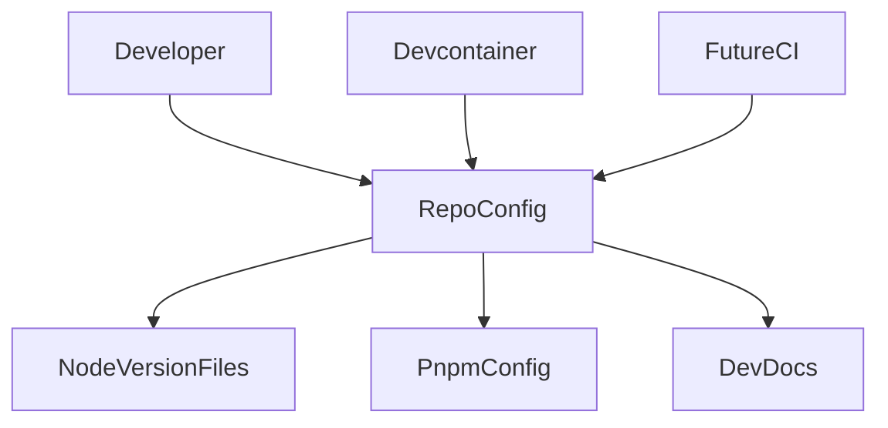
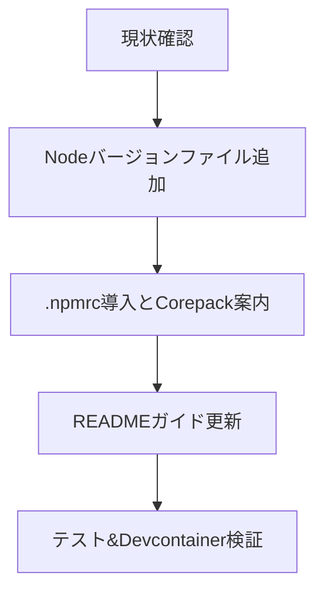

# Design Document

## Overview

この機能は todoix リポジトリに Node.js 24.10.0 と pnpm 10.19.0 の統一ツールチェーンを導入し、開発者と自動化パイプラインの双方が同一バージョンを利用できるようにする。プロジェクト参加者はリポジトリ直下のバージョン指定ファイルと`.npmrc`設定、README のガイドを参照することで迷わず環境準備を完了できる。  
対象ユーザーは既存・新規のコントリビューターおよび Devcontainer や CI などの自動化環境であり、バージョン差異によるビルド不一致や依存解決の失敗を防ぐことが主目的である。

### Goals

- Node.js 24.10.0 を明示するバージョン指定ファイルを整備する
- pnpm 10.19.0 の利用を `.npmrc` で強制し、挙動を統一する
- README にセットアップ手順とバージョン確認方法を明記する
- Devcontainer など既存の自動化環境と矛盾が無い状態を保つ

### Non-Goals

- Node.js / pnpm 以外の開発ツール（Vitest, Biome など）のバージョン管理
- CI/CD パイプラインの自動追加や変更
- Windows 向けのセットアップ手順の最適化

## Architecture

### Existing Architecture Analysis

- リポジトリルートに Node バージョン指定ファイルは存在しない。Devcontainer Feature が Node 24 を提供しているがパッチレベルは固定されていない。
- `.npmrc` は未配置のため、pnpm 利用はドキュメントの記述に依存している。
- README には Devcontainer 手順があるが、ローカル環境での Node / pnpm の導入手順は簡略記述のみ。
- CI など自動化の雛形は未構築のため、将来追加するワークフローに備え互換性のあるフォーマットを採用する必要がある。

### High-Level Architecture

**Architecture Integration**

- Existing patterns preserved: Devcontainer による Node 24 提供、README を単一ドキュメントとした情報提供方針
- New components rationale: NodeVersionFiles（`.node-version` / `.nvmrc`）、PnpmConfig（`.npmrc`）、DevDocs セクションの更新によりバージョン差異を排除
- Technology alignment: Node.js 24.10.0 / pnpm 10.19.0 は requirements で指定された最新パッチ版に一致
- Steering compliance: プロジェクト標準が未定義なため、一般的な Node.js/ pnpm 運用ベストプラクティスに従う

### Technology Alignment

- **Node バージョン指定**: `.node-version` および `.nvmrc` に `24.10.0` を記述し、Volta や asdf など主要ツールと互換性を確保する。
- **pnpm 設定**: `.npmrc` の `package-manager` フィールドで `pnpm@10.19.0` を宣言し、その他の挙動は既定値を維持する。
- **開発ガイド**: README の Devcontainer 章にローカル環境向け手順を追記し、Corepack を推奨インストール手段として提示する。
- **互換性チェック**: Devcontainer Feature（`ghcr.io/devcontainers/features/node:1`）がパッチバージョン指定を受け入れるかを確認し、未対応であれば post-create で `corepack` による pin を行う。

### Key Design Decisions

- **Decision**: `.node-version` と `.nvmrc` の双方で Node 24.10.0 を宣言する  
  **Context**: コントリビューターが利用するバージョンマネージャーが複数種類存在し、単一ファイルでは対応できない。  
  **Alternatives**: 1) `.node-version` のみを配置、2) `.nvmrc` のみを配置、3) Volta の `package.json` フィールドで統合管理。  
  **Selected Approach**: `.node-version` と `.nvmrc` を同一値で管理し、pre-commit 時のチェックで不一致を検出できるようにする。  
  **Rationale**: 主流ツールとの互換性を最大化しつつ、ファイル分割により既存ツールの自動検出を活かせる。  
  **Trade-offs**: ファイルが複数になるため更新コストが僅かに上がる。自動チェックを追加し同期を保証する必要がある。

- **Decision**: `.npmrc` の `package-manager` に厳密バージョン `pnpm@10.19.0` を指定し、Corepack 利用を前提にする  
  **Context**: グローバル pnpm インストールを避け、Devcontainer 以外の環境でも pnpm バージョンを強制したい。  
  **Alternatives**: 1) README に手動インストール手順のみ記載、2) `pnpm env use` などのスクリプトで切り替え、3) npm scripts で pnpm を同梱。  
  **Selected Approach**: `.npmrc` で `package-manager` を宣言し、Corepack がバージョン取得を担う構成にする。  
  **Rationale**: Node 16.17+ 環境で標準提供される Corepack と親和性が高く、CI や Devcontainer にも即座に適用できる。  
  **Trade-offs**: Corepack を無効化している環境では追加設定が必要。README で明確にフォローする。

## Components and Interfaces

### Repository Root Configuration

- **NodeVersionFiles**

  - ファイル: `.node-version`, `.nvmrc`
  - コンテンツ: 1 行で `24.10.0` を記述。余計な改行やコメントを禁止。
  - インターフェース: Node バージョンマネージャー（asdf, nvm, volta 等）が参照し、実行時に Node 24.10.0 を選択する。
  - バリデーション: `tests/toolchain/test_toolchain_versions.py`（新規）で両ファイルの内容一致と期待バージョンを検証。

- **NodeVersionCheckScript**（任意オプション）
  - 役割: `pnpm exec` で実行できる小スクリプトを提供し、CI やフックでバージョン不一致を検出。
  - 主な I/O: `node -v` / `pnpm -v` の出力を解析し、期待値との差異を報告。

### Package Manager Configuration

- **PnpmConfig**  
  - ファイル: `.npmrc`  
  - 主要キー: `package-manager=pnpm@10.19.0`  
  - インターフェース: `corepack enable` 済み環境で `.npmrc` を読み込み、pnpm 10.19.0 をダウンロード・利用する。  
  - エラーハンドリング: Corepack 未設定の場合は README の手順に従い個別に `corepack enable` を実行。

### Developer Guidance Documentation

- **DevDocsSection**
  - 対象: `README.md` の Devcontainer / セットアップ章。
  - 追記内容: Node 24.10.0 と pnpm 10.19.0 の導入手順、Corepack の利用方法、`node -v` / `pnpm -v` の期待出力例。
  - 参照: `.devcontainer/post-create.sh` により Codex CLI をインストールする流れも周知し整合性を確保。

### Verification Utilities

- **ToolchainTest**
  - 位置: `tests/toolchain/test_toolchain_versions.py`（仮称、新規追加）。
  - 目的: バージョンファイルと `.npmrc` の内容を検証し、CI やローカルで逸脱を即検知。
  - ロジック: JSON ではなくテキスト比較と `corepack` の有無チェックを中心に実装。

## Error Handling

- **Version Drift**: バージョンファイルが期待値と異なる場合、テストスイートで失敗し原因を表示する。手作業更新時は両ファイルを同時に変更するガイドを README に記載。
- **Corepack 未有効化**: README に `corepack enable pnpm@10.19.0` の手順とトラブルシューティングを追加し、環境差異を吸収する。
- **Devcontainer との差異**: Devcontainer Feature が `24.10.0` を直接受け入れない場合、post-create フックで `corepack` を利用しパッチバージョンを保証する fallback 流れを設計する。

## Testing Strategy

- **Unit / Static Checks**
  - バージョンファイル検証: `tests/toolchain/test_toolchain_versions.py` で `.node-version` と `.nvmrc` の一致・期待値をテスト。
  - `.npmrc` 内容検証: `package-manager` フィールドが `pnpm@10.19.0` であることを確認。
  - README 規約テスト（任意）: ドキュメントにバージョン文字列が存在するかをチェックしてドリフトを防止。
- **Integration Tests**
  - Devcontainer 起動後の `node -v` と `pnpm -v` を確認するハンドブックテスト。
  - Corepack 対応確認: ローカル環境で `corepack use pnpm@10.19.0` が成功することを検証。
- **E2E / 手動検証**
  - 新規開発者フロー: README の手順通りに環境構築し、`pnpm install` が成功することを確認。
  - Codex CLI との共存チェック: Devcontainer 内で `codex status` が既存認証を維持することを再確認。

## Migration Strategy

- **現状確認**: 既存の Node / pnpm 利用状況とドキュメントの整合性を把握する。
- **ファイル追加**: `.node-version` と `.nvmrc` を同時に追加し、内容を 24.10.0 に統一する。
- **設定導入**: `.npmrc` を配置し、Corepack で pnpm 10.19.0 を入手する手順を README に記載。
- **検証**: 新規テストを実行し Devcontainer で `node -v` / `pnpm -v` を確認、問題なければ告知して運用へ移行する。
