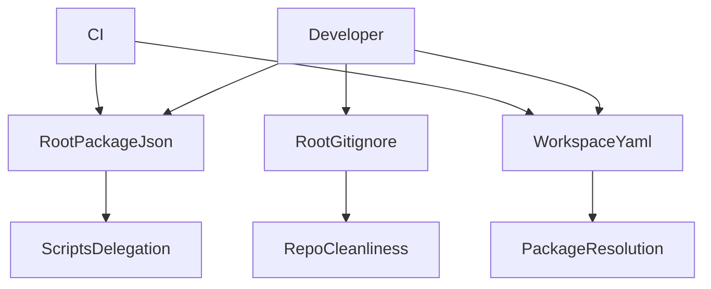
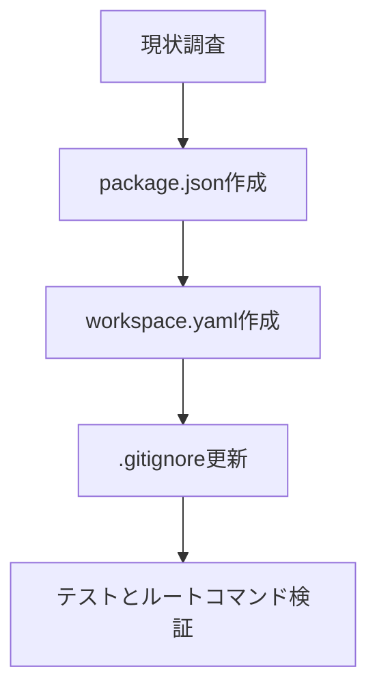

# Design Document

## Overview

todoix リポジトリに pnpm ワークスペース基盤を導入し、ルートコマンドで複数パッケージを統制できるようにする。対象ユーザーは既存・新規コントリビューターおよび CI などの自動化環境であり、Node 24.10.0 / pnpm 10.19.0 を前提に統一されたワークスペース設定を提供する。本設計はルート構成（package.json、pnpm-workspace.yaml、.gitignore）の標準化と検証手段を整備する。

### Goals

- ルート package.json に共通スクリプトと pnpm 固定バージョンを定義する
- pnpm-workspace.yaml で対象パッケージ範囲を宣言し、将来拡張しやすいパターンを採用する
- .gitignore を更新し、ワークスペース生成物を一括除外する
- 構成ファイルが要件と乖離した場合に検知できる検証を設ける

### Non-Goals

- パッケージ個別の scripts や依存関係の最適化
- CI/CD ワークフローの追加や変更
- Windows 固有のワークスペース調整

## Architecture

### Existing Architecture Analysis

- ルートに package.json・pnpm-workspace.yaml は未設置で、ワークスペース構成が始まっていない。
- Node 24.10.0 / pnpm 10.19.0 のバージョン固定は `.node-version` / `.nvmrc` / `.npmrc` で既に管理されている。
- `.gitignore` は存在するがワークスペース生成物の除外が未整備の可能性がある。
- 専用ステアリングは提供されていないため、pnpm の一般的なベストプラクティスに従う。

### High-Level Architecture

**Architecture Integration**

- Existing patterns preserved: Node/pnpm バージョン固定、tests/toolchain による設定検証を継続。
- New components rationale: ルート package.json と pnpm-workspace.yaml でマルチパッケージ運用を開始、.gitignore を補完。
- Technology alignment: Node 24.10.0 + pnpm 10.19.0 の想定に合わせ、Corepack との親和性を確保。
- Steering compliance: ステアリング不在のため、一般的な pnpm ワークスペース運用ルールを採用。

### Technology Alignment

- **ルート package.json**: `private: true`、`packageManager`、`engines`、共通 scripts（`build`、`dev`、`lint`、`test` など）を定義し、`pnpm -r` や `pnpm -C` を活用する。
- **pnpm-workspace.yaml**: `packages/*` をベースに、将来のサブディレクトリ追加に備える。
- **.gitignore**: `node_modules`、`dist`、`pnpm-lock.yaml` など既知生成物を網羅し、IDE 一時ファイルも除外。
- **検証**: tests/toolchain にルート構成ファイルを検証するテストを追加し、CI 連携を想定。

### Key Design Decisions

- **Decision**: ルート scripts で `pnpm -r` と `pnpm -C` を併用する  
  **Context**: すべてのパッケージに共通処理を適用しつつ、開発時に特定パッケージへデリゲートできる柔軟性が必要。  
  **Alternatives**: 1) ルートで直接 `pnpm run <cmd>`（単一パッケージ）を実行、2) シェルスクリプトでラップ、3) 個別 README に手順を記載。  
  **Selected Approach**: ルート scripts に `pnpm -r run <cmd>`、`pnpm -C packages/cli dev` などを明記して運用統一。  
  **Rationale**: pnpm 標準機能で完結し、マルチパッケージ間の統制を簡潔に保てる。  
  **Trade-offs**: scripts のメンテナンスが必要であり、プロジェクト拡張時に定期的な更新が求められる。

- **Decision**: pnpm-workspace.yaml にグロブパターンを採用する  
  **Context**: packages ディレクトリ配下に多数のパッケージが増える見込みであり、明示列挙は保守コストが高い。  
  **Alternatives**: 1) 各パッケージを個別列挙、2) pnpm の include/exclude 設定を追加で記述。  
  **Selected Approach**: `packages/*` などの広範囲グロブを使用し、必要に応じてサブディレクトリを追加できるようにする。  
  **Rationale**: シンプルで拡張に強く、pnpm の標準ガイドラインに沿う。  
  **Trade-offs**: 意図しないディレクトリが packages 配下にあると自動でワークスペース登録されるため、命名ルールの徹底が必要。

## Components and Interfaces

### Root Package Configuration

- **RootPackageJson**
  - ファイル: `package.json`
  - 内容: `name`, `private`, `packageManager`, `engines`, 共通 scripts。
  - インターフェース: `pnpm run <script>` を入口にワークスペースに委譲。
  - 検証: tests/toolchain にて JSON パースして必須キーをチェック。

### Workspace Definition

- **WorkspaceYaml**
  - ファイル: `pnpm-workspace.yaml`
  - 内容: `packages:` セクションで対象パス列挙。
  - インターフェース: pnpm CLI が参照し、`pnpm -r` や `pnpm install` の解決範囲を決定。
  - 検証: tests/toolchain で YAML を解析し、期待パターンを確認。

### Ignore Policy

- **RootGitignore**
  - ファイル: `.gitignore`
  - 内容: `node_modules/`, `dist/`, `pnpm-lock.yaml`, `*.log`, `.DS_Store` など。
  - インターフェース: Git が生成物を除外。
  - 検証: Lint/静的チェックやテストで必須パターンの存在を検証。

## Error Handling

- **Scripts 不足**: tests/toolchain で scripts の存在を検証し、欠落時に明示的なエラーを報告する。
- **ワークスペース解決失敗**: pnpm-workspace.yaml のパターンが不十分な場合、テストで検知してパターン追加を促す。
- **除外漏れ**: .gitignore に必要なパターンが無い場合、テストで通知し、コミット前に気づけるようにする。

## Testing Strategy

- **Unit / Static Checks**: tests/toolchain に JSON/YAML 読み込みテストを追加し、必要キー・パターンの存在を確認。
- **Integration Tests**: Devcontainer またはローカルで `pnpm run build` 等を実行し、scripts が想定通り機能するか手動検証。
- **E2E**: 初回セットアップ手順に従って `pnpm install` / `pnpm run dev` を試行し、ワークスペース動作を確認。
- **Regression Guard**: README のバージョン記述テストを流用し、構成変更がドキュメントとずれた場合に検知する。

## Migration Strategy

- **Phase0**: 既存ドキュメントと設定ファイルの有無を確認。
- **Phase1**: ルート package.json を追加し scripts を実装。
- **Phase2**: pnpm-workspace.yaml を追加し対象パターンを定義。
- **Phase3**: .gitignore を更新し生成物を除外。
- **Phase4**: tests/toolchain の新規テストを実行し、`pnpm run build` 等を手動検証して完了。
